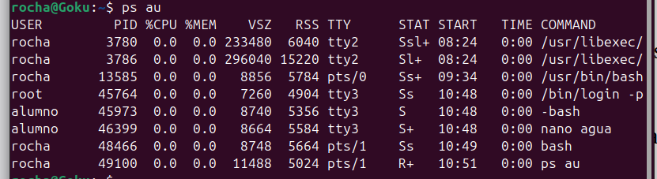
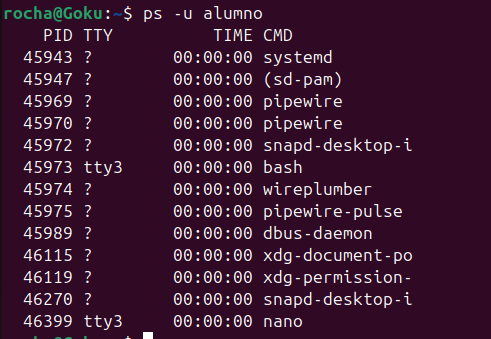
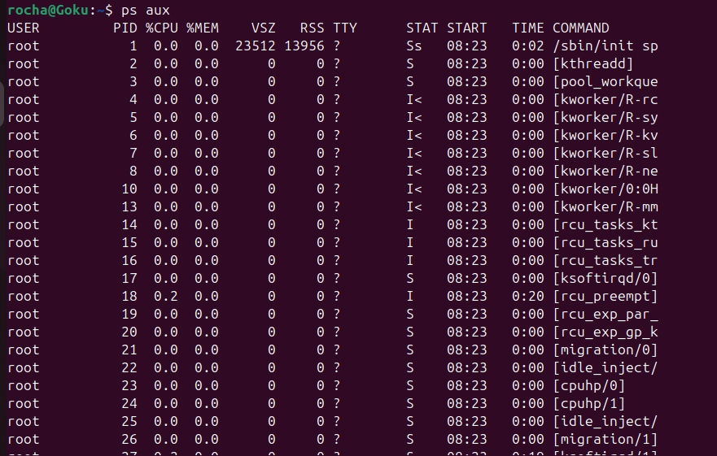
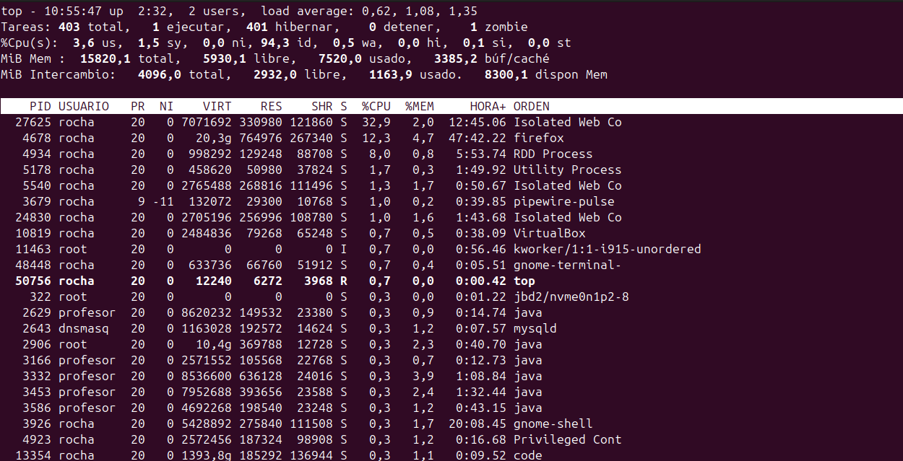
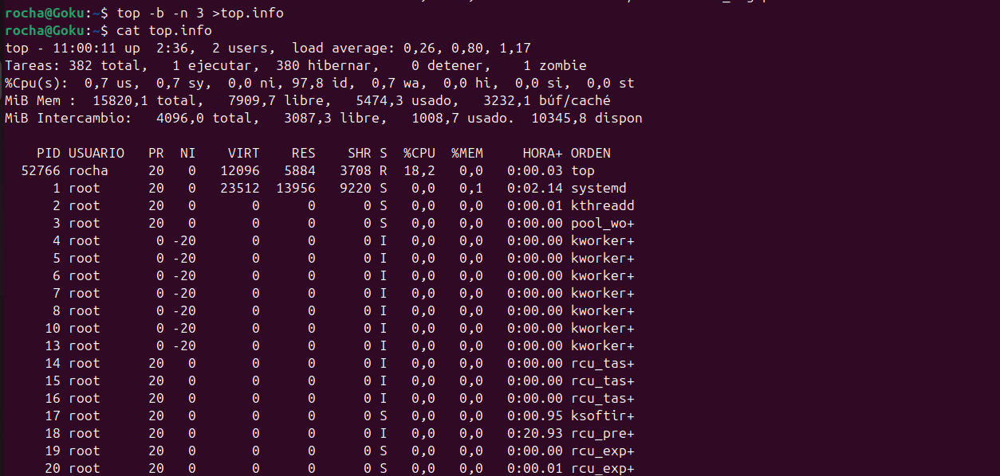
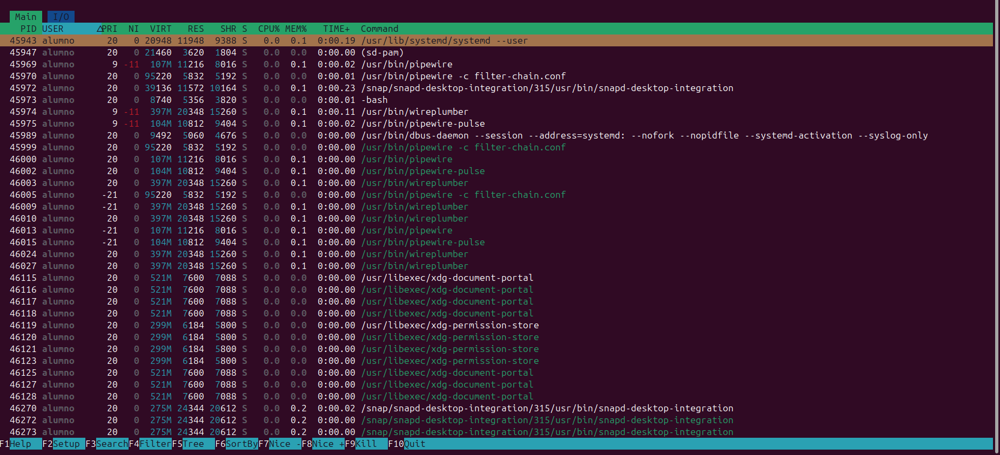
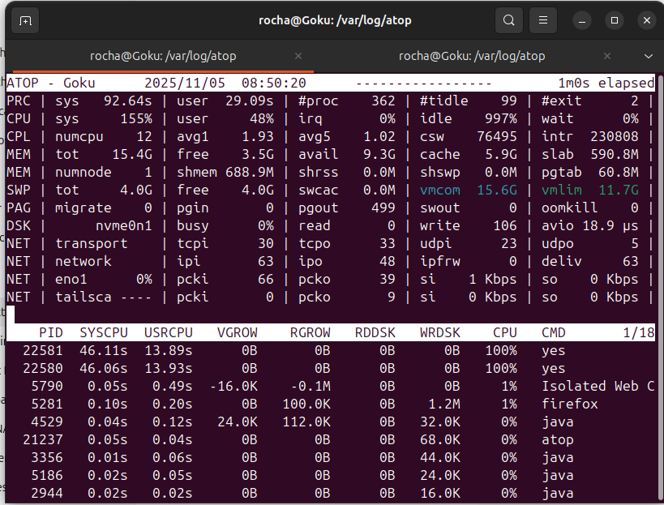

# 📌 Resumen del comando `ps` en Linux

El comando `ps` (process status) muestra información sobre los procesos en ejecución en el sistema.

## 🧭 Opciones más utilizadas

| Comando | Descripción |
|--------|-------------|
| `ps` | Muestra los procesos del usuario actual en la terminal actual. |
| `ps -e` | Lista **todos** los procesos del sistema. |
| `ps -f` | Muestra formato extendido (PPID, UID, tiempo, etc.). |
| `ps -ef` | Lista todos los procesos con formato completo (muy usado). |
| `ps aux` | Lista todos los procesos con información detallada usando estilo BSD. |
| `ps aux --sort=-%cpu` | Ordena procesos por **uso de CPU**. |
| `ps aux --sort=-%mem` | Ordena procesos por **uso de memoria**. |
| `ps -u <usuario>` | Muestra procesos pertenecientes a un usuario. |
| `ps -p <PID>` | Muestra información de un PID específico. |

## 🔍 Ejemplos útiles

```bash
# Ver todos los procesos con formato extendido
ps -ef

# Ver procesos ordenados por uso de CPU
ps aux --sort=-%cpu | head

# Ver procesos de un usuario
ps -u nombre_usuario

# Obtener detalles de un proceso concreto
ps -p 1234 -f
```
Algunos ejemplos de usos comunes en pantalla de comandos:


---

---

---


# 📌 Resumen del comando `top` en Linux

El comando `top` muestra en tiempo real los procesos que se están ejecutando en el sistema, junto con estadísticas de uso de CPU, memoria y carga del sistema.

---

## 🧭 Información que muestra `top`

| Sección | Descripción |
|--------|-------------|
| **Load Average** | Carga del sistema en los últimos 1, 5 y 15 minutos. |
| **Tasks** | Número de procesos en ejecución, durmiendo, detenidos o zombis. |
| **CPU(s)** | Porcentaje de uso de CPU (usuario, sistema, ociosa, etc.). |
| **Mem / Swap** | Uso de memoria RAM y memoria swap. |
| **Listado de procesos** | Muestra PID, usuario, %CPU, %MEM, tiempo y comando. |

---

## 🧩 Campos principales de cada proceso

| Campo | Significado |
|-------|-------------|
| **PID** | ID del proceso. |
| **USER** | Usuario que ejecuta el proceso. |
| **%CPU** | Uso de CPU del proceso. |
| **%MEM** | Uso de memoria RAM. |
| **TIME+** | Tiempo total de CPU consumido. |
| **COMMAND** | Nombre del comando del proceso. |

---

## ⌨️ Atajos de teclado útiles

| Tecla | Acción |
|-------|--------|
| **h** | Muestra la ayuda. |
| **q** | Salir de `top`. |
| **k** | Matar un proceso (pide PID). |
| **r** | Cambiar la prioridad (renice). |
| **M** | Ordenar por uso de memoria. |
| **P** | Ordenar por uso de CPU. |
| **u** | Filtrar por usuario. |
| **1** | Ver uso de cada CPU individual. |

---

## 🔍 Ejemplos

```bash
# Ejecutar top normalmente
top

# Ordenar por uso de CPU al iniciar
top -o %CPU

# Ver solo procesos de un usuario
top -u nombre_usuario
```
Ejemplos de usos comunes de top:


---

---


# 📌 Resumen del comando `htop` en Linux

`htop` es una versión mejorada y visual del comando `top`, que permite monitorizar procesos y recursos del sistema de forma interactiva y más intuitiva.

---

## 🧭 Características principales

- Interfaz colorida y fácil de entender.
- Uso de CPU, RAM y SWAP en barras gráficas.
- Permite **matar**, **renombrar**, **pausar** o **cambiar prioridad** a procesos fácilmente.
- Navegación con el teclado y/o ratón.
- Visualización de **todos los hilos (threads)**.
- Filtros y ordenación dinámica.

---

## 🧩 Información mostrada

| Sección | Descripción |
|--------|-------------|
| **CPU Meter** | Uso de cada núcleo de la CPU. |
| **Memory / Swap** | Barras de consumo de RAM y SWAP. |
| **Tasks / Load average** | Número de procesos y carga del sistema. |
| **Process list** | Procesos con PID, usuario, %CPU, %MEM, estado y comando. |

---

## ⌨️ Atajos útiles en `htop`

| Tecla | Función |
|-------|----------|
| **F1** | Ayuda. |
| **F2** | Configuración (colores, columnas, orden…). |
| **F3** | Buscar proceso. |
| **F4** | Filtro por texto. |
| **F5** | Vista en árbol. |
| **F6** | Ordenación. |
| **F9** | Enviar señal (matar proceso). |
| **F10** | Salir. |
| **Espacio** | Marcar proceso. |
| **u** | Filtrar por usuario. |

---

## 🔍 Ejemplos rápidos
```bash
# Abrir htop
htop

# Mostrar hilos (threads)
htop -t

# Ordenar por uso de memoria al iniciar
htop --sort-key=MEM

# Ver solo procesos de un usuario
htop -u nombre_usuario
```



# 📌 Monitorización con `atop` en Linux

`atop` es una herramienta avanzada de monitorización que ofrece una visión detallada del rendimiento del sistema, mostrando información sobre **CPU, memoria, discos, red y procesos**. Es más completa que `top` y `htop`, y permite registrar datos para analizarlos posteriormente.

---

## 🧭 Características principales

- Monitorización **completa** del sistema.
- Destaca con **colores** recursos que están sobrecargados.
- Permite **registrar** el uso del sistema para análisis histórico.
- Muestra información detallada de **I/O por proceso**.
- Identifica los procesos que generan picos de carga.
- Interfaz clara y ordenada de métricas.

---

## 🧩 Secciones principales de `atop`

| Sección | Descripción |
|--------|-------------|
| **PRC** | Estadísticas generales de procesos. |
| **CPU** | Uso total de CPU, I/O wait y saturación. |
| **CPL** | Load average, interrupciones y cambios de contexto. |
| **MEM** | Uso de memoria RAM, caché y buffers. |
| **SWP** | Estado de la memoria swap. |
| **DSK** | Actividad de discos: lecturas, escrituras y tiempos de espera. |
| **NET** | Actividad de red: paquetes enviados/recibidos y errores. |
| **Processes** | Lista avanzada de procesos con CPU, memoria e I/O. |

---

## 🔍 Ejecución básica

```bash
# Ejecutar atop en tiempo real
atop
```



