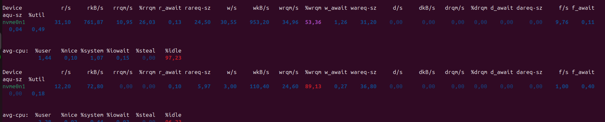
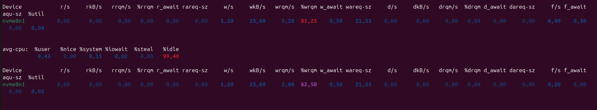
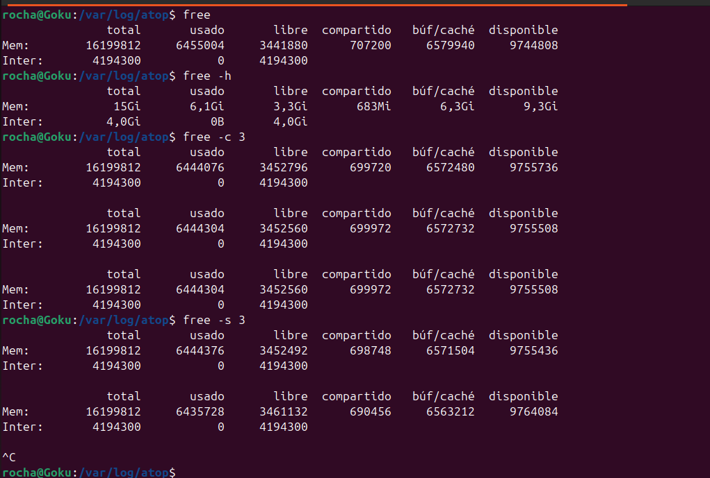
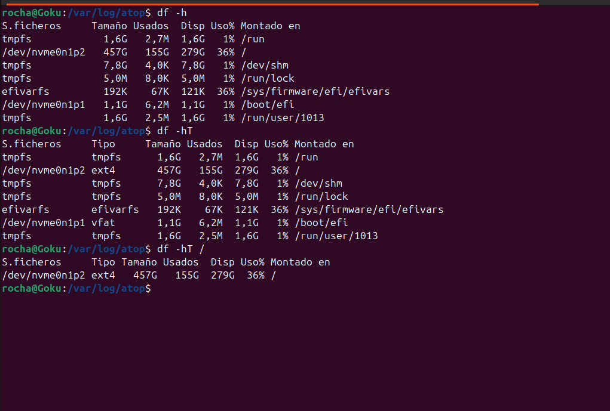
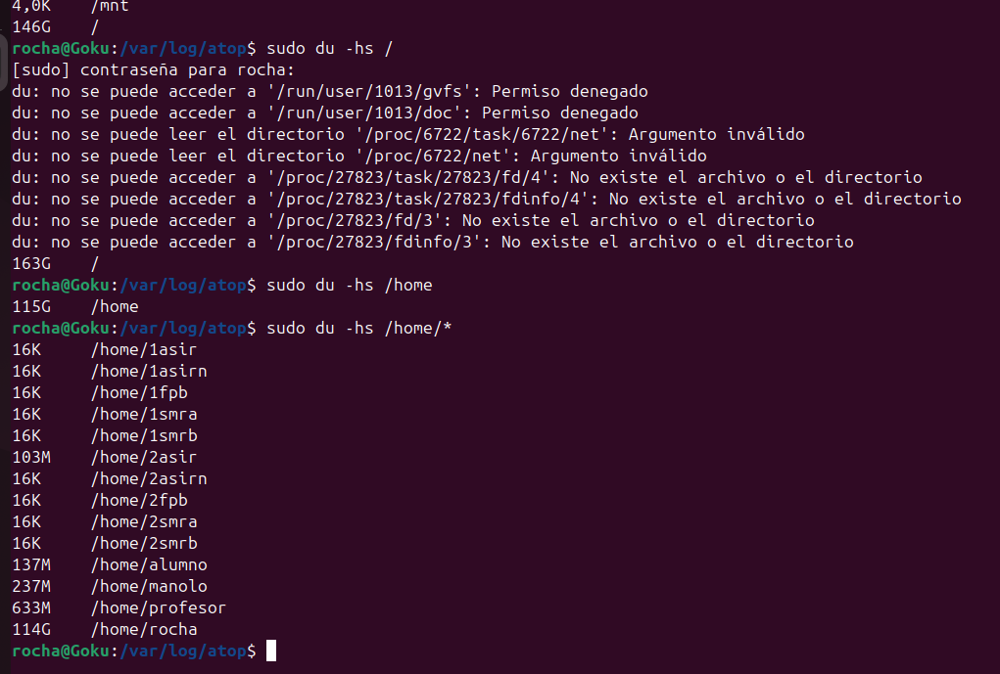

# Unidad 2: Reporte de Análisis de Recursos del Servidor

Este documento recopila las métricas de rendimiento obtenidas del sistema para la Unidad 2, analizando el comportamiento del disco (I/O), el uso de almacenamiento y la gestión de memoria RAM.

---

## 1. Monitorización de Entrada/Salida de Disco (I/O)

Se utilizó el comando `iostat` para analizar la latencia y el uso del disco NVMe.

### Ejecución del comando
El comando utilizado fue `iostat -x nvme0n1 5`.
* `-x`: Muestra estadísticas extendidas (necesario para ver `%util` y latencias).
* `nvme0n1`: Filtra para mostrar solo el disco principal.
* `5`: Refresca los datos cada 5 segundos.

### Resultados y Análisis
A continuación se muestran las métricas obtenidas durante el intervalo de muestreo:

**Interpretación:**
* **Carga del Disco (%util):** El uso del disco es extremadamente bajo (oscila entre **0.02%** y **0.49%**). Esto indica que el almacenamiento no es un cuello de botella actualmente.
* **Optimización (%wrqm):** Se observa un alto porcentaje de *Write Request Merging* (entre 53% y 89%). El sistema operativo está agrupando eficientemente las escrituras pequeñas en operaciones más grandes.
* **Latencia (await):** Los tiempos de espera son muy bajos, comportamiento esperado en discos NVMe.
* **CPU:** El sistema está ocioso (*idle*) más del 97% del tiempo.

---

## 2. Gestión de Memoria RAM

Se utilizó el comando `free` con varias banderas (`-h`, `-c`, `-s`) para verificar la disponibilidad de memoria física y de intercambio (swap).

**Interpretación:**
* **Total:** El sistema cuenta con **15 GiB** de RAM.
* **Uso:** Se están utilizando aproximadamente **6.1 GiB**.
* **Disponible:** Hay **9.3 GiB** disponibles para nuevas aplicaciones (incluyendo caché).
* **Swap:** La memoria de intercambio está en **0 B** de uso, lo cual es excelente para el rendimiento, ya que indica que no se está utilizando el disco para paginación de memoria.

---

## 3. Uso de Espacio en Sistema de Archivos

Se utilizó `df` (*Disk Free*) para ver el espacio general de las particiones montadas.

**Interpretación:**
* **Partición Raíz (/):** Montada en `/dev/nvme0n1p2` con sistema de archivos **ext4**.
* **Estado:**
    * Tamaño total: **457 GB**.
    * Ocupado: **155 GB** (36%).
    * Libre: **279 GB**.
* El almacenamiento está saludable con más del 60% de espacio libre disponible.

---

## 4. Desglose de Directorios Pesados

Para identificar qué está consumiendo los 155 GB detectados anteriormente, se utilizó el comando `du` (*Disk Usage*).

**Interpretación:**
1.  **Análisis de Raíz (`/`):** Muestra errores de lectura en `/proc`, `/run` y `/sys`. Esto es **normal**, ya que son directorios virtuales del sistema y no archivos físicos.
2.  **Directorio `/home`:** Se identifica como el consumidor principal de espacio con **115 GB**.
3.  **Desglose por Usuario:** Dentro de `/home`, el usuario **`rocha`** está ocupando **114 GB**, siendo el responsable de la mayor parte del consumo de disco en el servidor.

---
*Generado para la Unidad 2 - Monitorización*
