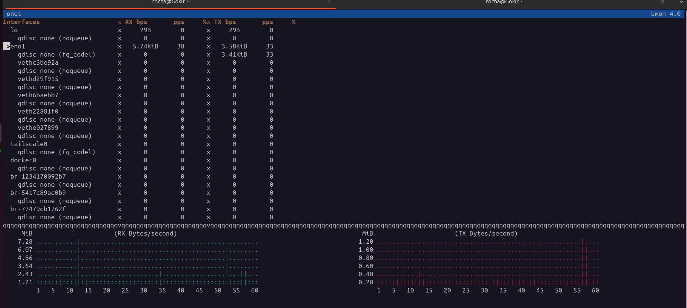
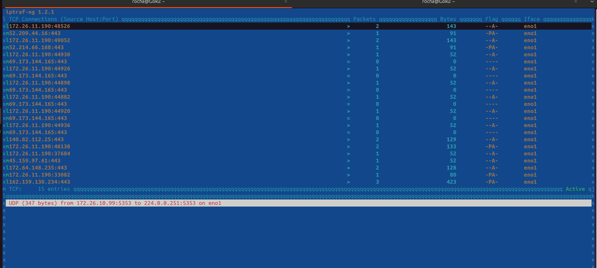
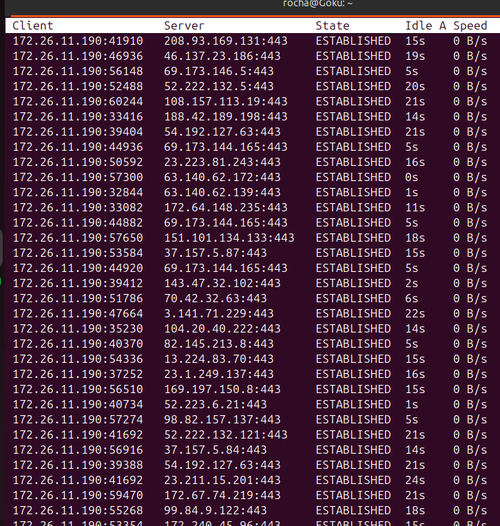

# Unidad 3: Monitorización y Análisis de Tráfico de Red

Este documento detalla las herramientas utilizadas para el análisis de tráfico de red, monitorización de ancho de banda y seguimiento de conexiones TCP/IP en el servidor.

---

## 1. Captura de Paquetes con `tcpdump`

Se utilizó `tcpdump` para realizar un análisis de bajo nivel de los paquetes que atraviesan la interfaz de red.

### Ejecución y Resultados
El comando utilizado fue `sudo tcpdump`. Esta herramienta captura y muestra las cabeceras de los paquetes en tiempo real.

**Análisis de la captura:**
* **Protocolos:** Se observan peticiones **ARP** (Address Resolution Protocol) para resolver direcciones MAC e IPs locales.
* **DNS:** Hay múltiples consultas a servidores de nombres (se ven respuestas `NXDomain`, lo que indica resoluciones de dominio inversas o fallidas).
* **Flag TCP:** Se identifican banderas de control de flujo TCP como `Flags [P.]` (Push) y `Flags [F.]` (Finish), indicando transferencia de datos y cierre de conexiones respectivamente hacia la IP local `172.26.X.X`.

---

## 2. Monitorización de Ancho de Banda con `bmon`

`bmon` (Bandwidth Monitor) proporciona una visión gráfica y en tiempo real del flujo de datos en todas las interfaces.

**Interpretación:**
* **Interfaces:** Se listan todas las interfaces (físicas como `eno1` y virtuales como `docker0` o `veth...`).
* **Actividad:** La interfaz principal **`eno1`** es la única con tráfico significativo en este momento (RX: ~5.74 KiB/s, TX: ~3.58 KiB/s).
* **Gráficos:** Los paneles inferiores muestran el historial de recepción (RX) y transmisión (TX), permitiendo identificar picos de tráfico visualmente.

---

## 3. Estadísticas de Tráfico IP con `iptraf-ng`

Se utilizó `iptraf` para observar estadísticas detalladas de las conexiones TCP activas, incluyendo conteo de paquetes y bytes.

**Análisis:**
* **Conexiones:** Se muestra una lista detallada de conexiones TCP desde el host local (`172.26.11.190`) hacia varias IPs externas.
* **Puerto 443:** La mayoría de las conexiones son hacia el puerto 443 (HTTPS), indicando tráfico web seguro.
* **Volumen:** Permite ver qué conexión específica está consumiendo más paquetes (Columna *Packets*) o bytes (Columna *Bytes*) en tiempo real.
* **Alertas:** En la parte inferior se observa una notificación de un paquete UDP de *broadcast* o *multicast*.

---

## 4. Seguimiento de Conexiones TCP con `tcptrack`

`tcptrack` se utilizó para visualizar el estado de las conexiones de una forma similar al comando `top` pero para red, mostrando el ancho de banda por conexión.

### Ejecución del comando
El comando utilizado fue `sudo tcptrack -i eno1` para escuchar específicamente en la interfaz física principal.

### Resultados

**Interpretación:**
* **Estado (State):** Todas las conexiones mostradas están en estado **ESTABLISHED**, lo que significa que el enlace ("handshake") se ha completado correctamente y la sesión está activa.
* **Tiempos de inactividad (Idle):** La columna *Idle* muestra cuántos segundos han pasado desde el último paquete transferido en esa conexión (ej. 15s, 20s).
* **Velocidad:** En el momento de la captura, la velocidad (*Speed*) es 0 B/s, indicando que las conexiones están abiertas pero no están transfiriendo datos activamente en ese preciso segundo.

---
*Generado para la Unidad 3 - Redes*
