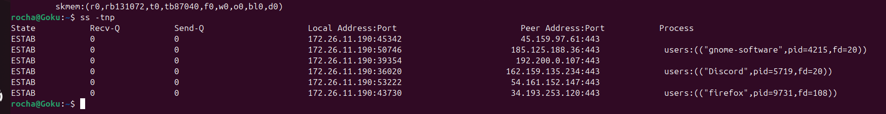
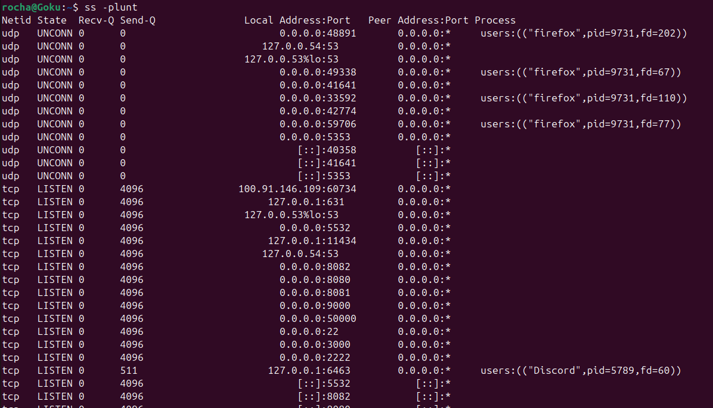
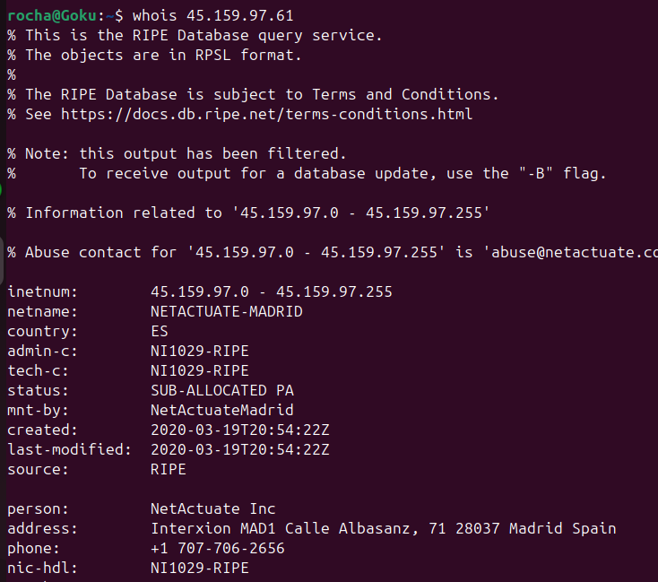
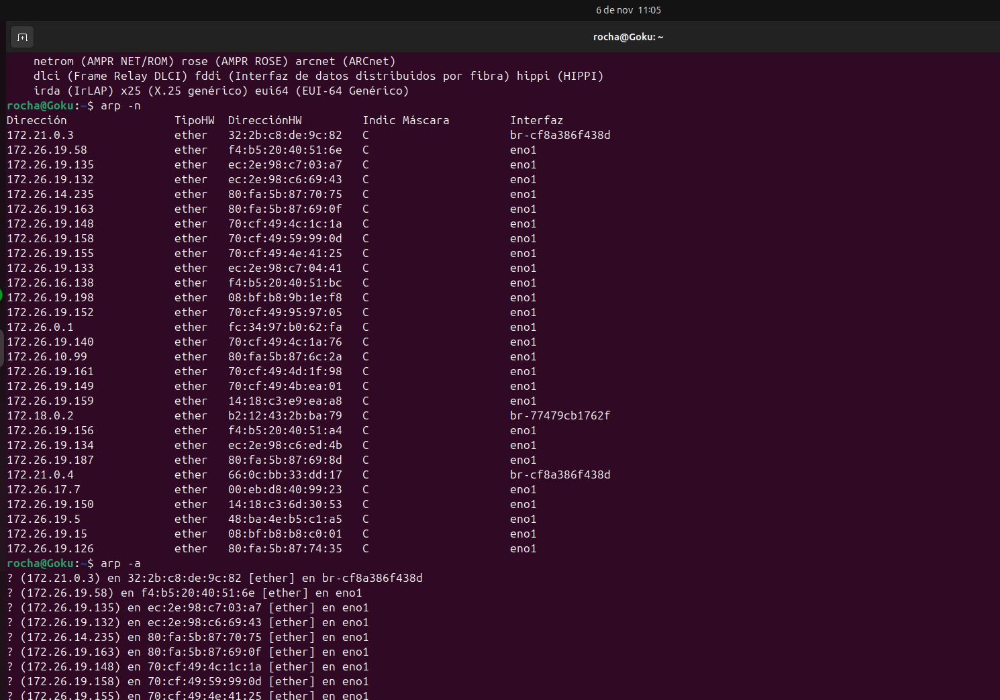
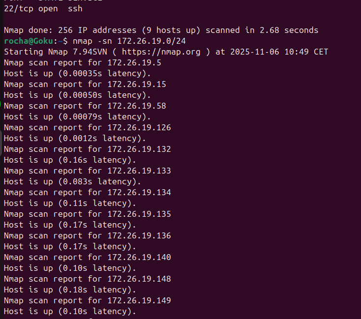
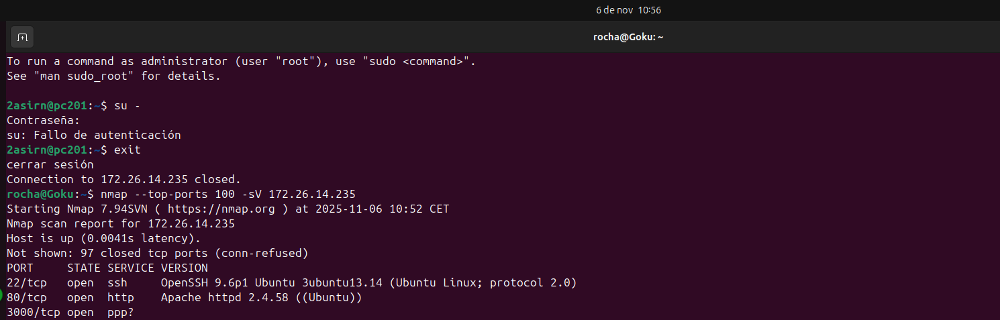

# Unidad 4: Auditoría y Reconocimiento de Red

En esta sección se utilizan herramientas avanzadas para analizar conexiones activas, identificar servicios a la escucha y realizar escaneos de red para descubrir hosts y vulnerabilidades.

---

## 1. Análisis de Sockets con `ss`

El comando `ss` (Socket Statistics) es el sustituto moderno de `netstat`. Se utilizó para inspeccionar tanto las conexiones establecidas como los puertos a la escucha.

### Conexiones Establecidas
Se ejecutó `ss -tnp` para ver las conexiones TCP activas.
* `-t`: TCP.
* `-n`: Numérico (no resuelve nombres de dominio, lo que lo hace más rápido).
* `-p`: Muestra el proceso que utiliza el socket.

**Análisis:**
* Se observan conexiones establecidas (**ESTAB**) desde la IP local hacia servidores remotos en el puerto **443 (HTTPS)**.
* Se identifican los procesos responsables: `firefox`, `discord` y `gnome-software`.
* Destaca una conexión hacia la IP `45.159.97.61`.

### Puertos a la Escucha
Se ejecutó `ss -plunt` para ver qué servicios está ofreciendo el servidor.
* `-l`: Listening (a la escucha).
* `-u`: UDP.

**Análisis:**
* El servidor tiene múltiples puertos abiertos:
    * **TCP 22:** Servicio SSH.
    * **TCP 8080, 8081, 8082, 3000:** Probablemente servidores web de desarrollo o aplicaciones.
    * **TCP 631:** Servicio de impresión (CUPS).
    * **UDP 53:** DNS (systemd-resolve).

---

## 2. Identificación de IPs con `whois`

Al detectar una conexión activa hacia la IP `45.159.97.61` en el paso anterior, se utilizó el comando `whois` para obtener información sobre su propietario.

**Resultados:**
* La IP pertenece a **NETACTUATE-MADRID**.
* El proveedor está localizado en España (Country: ES).
* Esto ayuda a verificar si el tráfico es legítimo (en este caso, parece ser tráfico hacia un servidor en un centro de datos en Madrid).

---

## 3. Tabla de Resolución de Direcciones (`arp`)

El comando `arp` permite ver la caché ARP del sistema, que asigna direcciones IP a direcciones físicas (MAC) en la red local.

**Interpretación:**
* **`arp -n`**: Muestra las entradas en formato numérico.
* **`arp -a`**: Muestra las entradas en un formato alternativo (estilo BSD).
* Se puede observar una gran cantidad de dispositivos detectados en la red `172.26.x.x` a través de la interfaz `eno1`. Esto indica que el servidor está en una red con muchos otros vecinos activos.

---

## 4. Escaneo de Red con `nmap`

`nmap` es la herramienta estándar para el descubrimiento de red y auditoría de seguridad.

### Descubrimiento de Hosts (Ping Scan)
Se utilizó el comando `nmap -sn 172.26.19.0/24`.
* `-sn`: Ping Scan (anteriormente conocido como `-sP`). No escanea puertos, solo verifica si los hosts están encendidos.

**Resultados:**
* Nmap escaneó 256 direcciones IP.
* Detectó **9 hosts activos** (Hosts up).
* Muestra la latencia de cada host, que es muy baja (< 0.001s), confirmando que están en la red local.

### Detección de Servicios y Versiones
Tras descubrir hosts, se procedió a escanear uno específico (`172.26.14.235`) para ver qué corre en él.
* Comando: `nmap --top-ports 100 -sV 172.26.14.235`
* `--top-ports 100`: Escanea solo los 100 puertos más comunes.
* `-sV`: Intenta determinar la versión del servicio que se ejecuta en el puerto.

**Resultados del host 172.26.14.235:**
* **Puerto 22 (SSH):** Corriendo OpenSSH 9.6p1 (Ubuntu).
* **Puerto 80 (HTTP):** Corriendo Apache httpd 2.4.58.
* **Puerto 3000:** Detectado pero con servicio incierto (`ppp?`).

